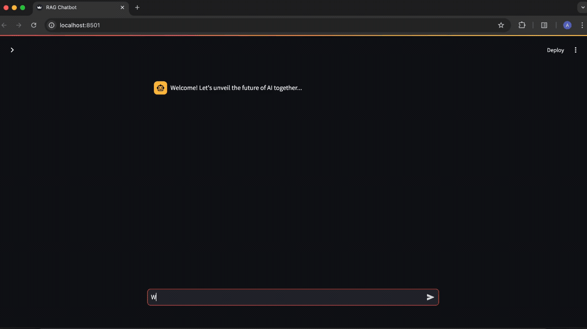

# RAG Chatbot for PDFs




## Installation
```
# Clone this repository
git clone https://github.com/AntaraGanapathy/rag-chatbot.git
cd rag-chatbot
```

```
# Installing the libraries
pip install -r requirements.txt

---

pip install langchain-community==0.2.16
pip install pinecone==5.1.0
pip install PyPDF2==3.0.1
pip install python-dotenv==1.0.1
pip install streamlit==1.37.1
pip install sentence-transformers==3.0.1
```

```
# Update API keys in .env
PINECONE_API_KEY=XXXXXXXX
HUGGINGFACE_API_KEY=XXXXXXXX
```

```
# Execution
streamlit run main.py
```

## Pinecone account set-up
- Create an account at [https://www.pinecone.io/](https://www.pinecone.io/)
- Click on 'Projects' in the top menu bar, and navigate to 'API Keys' in the sidebar
- Note down the default API key and add it to the .env file

## Hugging Face account setup
- Create an account at [https://huggingface.co/join](https://huggingface.co/join)
- Click on 'Profile' in the sidebar and navigate to 'Edit Profile'
- Under 'Access Tokens' click on the 'Create a new token' button
- Select 'Read' and enter the token name
- Note down the API key displayed and add it to the .env file

## Customization
- Replace the `sample.pdf` file with the PDF of choice
- Edit filename in `rag.py`
- Select an appropriate range of pages needed to train the chatbot in `data.py`
- Customize the default template in `rag.py` to the desired use case

